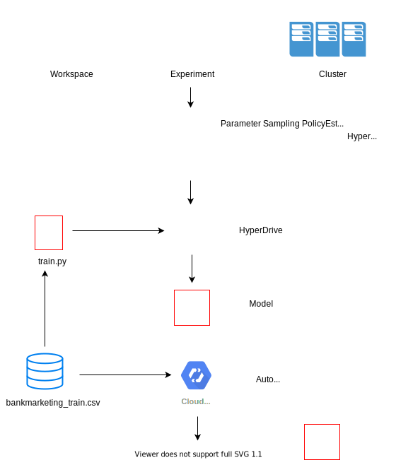

# Optimizing an ML Pipeline in Azure

## Table of Contents

- [Optimizing an ML Pipeline in Azure](#optimizing-an-ml-pipeline-in-azure)
  * [Overview](#overview)
  * [Summary](#summary)
  * [Scikit-learn Pipeline](#scikit-learn-pipeline)
  * [AutoML](#automl)
  * [Pipeline comparison](#pipeline-comparison)
  * [Future work](#future-work)

## Overview

This project is part of the Udacity Azure ML Nanodegree.

In this project, I build and optimize an Azure ML pipeline using the Python SDK and a provided Scikit-learn model.
This model is then compared to an Azure AutoML run.

## Summary

This is a subset of a standard machine learning dataset with data about the direct marketing campaigns of a Portuguese banking institution. It provides 20 independent variables, both numerical and categorical, about bank clients, and a categorical dependant variables: has the client subscribed a term deposit? (binary: 'yes','no'). This last one variable is what I try to predict in this classifcation excersise.

To that end, I'm trying three diferent ways to get an accurate model:

1) a Python script, with a Logsitic Regression algorithm, using the Scikit-Learn implementation

2) with this same script, I try to get optimum parameters using Azire HyperDrive, in order to get a better logistic regression model

3) lastly I use the AutoML capabilities of AzureML to explore the models space, in order to know if there are models, other than LOgistic Regression, capable og getting better accuracy levels.

The process is summarised in the folowing diagram:

This is a subset of a standard machine learning dataset with data about the direct marketing campaigns of a Portuguese banking institution. It provides 20 independent variables, both numerical and categorical, about bank clients, and a categorical dependant variables: has the client subscribed a term deposit? (binary: 'yes','no'). This last one variable is what I try to predict in this classifcation excersise.

The best performing model I found was a VotingEnsemble, generated in the AutoML part of the AzureML experiment, that got a 0.9161 of accuracy. It must be said that best models were all in the range between 0.911 and the above mentioned 0.916.

## Scikit-learn Pipeline

I began with a stand-alone Python script, implementing a Scikit_learn model of logistic regression, a classical classification algorithm. That the algorithm was meant to be a logistic regression was a given, that I accepted without questioning, even when I knew there were other classification algorithms available for scuh a task. 

Data were loaded from an internet adress (url), cleaned, transformed and divides in training and test sets.

In order to run the algortihm, two parameters were defined:

- C: a positive float number, which is the Inverse of regularization strength, and was set to a default of 1 (the greater the value, the lesser the regularization). 

-max_iter: a positive integer, meaning the number of iterations the algortihm is allowed to run before convergence (default set to 100).

I chose a space from 1.0 (default) to 0.1, since increasing the regularization parameter in runing train.py, even when increasing the number of iterations, didn't get better accuracy results. Thus I supposed than a lesser C value (that is, a greater regularization term) would led to a greater accuracy of the model.

In the same way, I noticed that, sometimes, the algotihm didn't converge in a better solution since it reached the limit of the total number of iterations. Thus, I tried to sample the space between 100 (default value) and 1000, choosing 5 discerte values, evenly distributed in this sapece.

Afterwards, this same script was uploaded to an AzureML notebook space, and a notebook was used to run an HyperDrive experiment, trying to get, automatically, the best model parameters for the original script.

Since previous trials with the original script had shown me that neither trying several values of C nor of max_iter got much effect on accuracy, I discarded a Grid Parameter Sampling (a sampler method that supports discrete hyperparameters), since it would have forced me to specify choice values for C (which is a continu¿ous parameter), and opted for a Random Parameter Sampler, so HyperDrive could choose, randomly, different values of C, and combine them with a certain numer of values of max_iter, treating it as discrete variable (integer values), ranging, as said, from 100 (default) and 1000 (since no greater values were capable of offering better results with the original script).

I was shy to use the Bayesian Parameter Sampling, since I quite don't understand yet how it works, and there was a hint of undeperforming when concurrent runs were defined. as well as a demmand of many runs (20 times the number of hyperparameters being tuned) to be of any use. In retrospective, it's something I should have given a try. And I'll do.

Thus, the main benefit of the chosen parameter sampler was the ability to narrow down options to a known and limited space with both discrete and continuous parameters.

As to the stoping policy, I discarded a Median Stopping Policy since I knew, beforehand, that the range of accuracy values was a very narrow one, and thus the probability that any given run was worse than the median of the previous ones was something near mere chance.

The Truncation Selection Policy didn't seem a good option either, since it forced me to define a truncation percentage that I didn't feel capable of defining with such a narrow experience with the problem, and that I deemed would have to be high in order to be of any use.

Instead, I choose a BanditPolicy, a rather aggresive policy, since the trials with the original script in a Python environment had shown me that there were little gains in accuracy from run to run, even with wide changing parameter values. Thus, I defined a slack factor of 0.05 every 2 runs, something I look now as a too tight a criterium.

## AutoML

In the given time, the AutoML experiment run 37 diferent models, the best being a Voting Ensemble model, with an accuracy of 0.91611.

Votig Ensemble is a class that can't be invoqued directly, but can be specified in the AutoMLConfig instance.

In this case, it's a default AutoML uses once it has run several models. If I understood this right, this implementation uses a soft voting mechanism, summing up the predicted probabilities for class labels in the previous tested models, and predicting the class label with the largest sum probability.

## Pipeline comparison

As said, the AutoML Votign Ensemble model got an accuray of 0.91611, against an accuracy of 0.91163 of the HyperDrive model, and 0.91102 of the original script. So, the gain was a meager one, in the order of the thousandths.

AutoML is a better architecture than that provided by HyperDrive, since whereas this last one gets the original model for a given and only tries to optimize its parametes, AutoML takes hold of a combination of scalers (MaxAbsScaler, SparseNormalizer and StandardScalarWraper)
and models (ExtremeRandomTrees, LightGBM, RandomForest, SGD, XGBoostClassifier, as well as Voting and Stack Ensembles) to look for a better model.

## Future work

Since this is an unbalanced data set, perhaps accuracy is not the best criterium to optimize, and AUC or weighted AUC woukd be better performance metrics.

Are there other classification algorithms that would merit a try? Since this is a two-class classification problem, algorithms like Two-Class Support Vector Machines, Two-Class Averaged Perceptrons or Two_class Neural Networks would merit a try.

Could different parameter sampling methods and policies bring a better result? As seen, there is at least another hyperparameter sampler (namely, Bayesian) that could be used, as well as two other stopping policies (Median and Trunaction Selectiona, as mentioned above) that would merit a try. Even, one can opt for a no termination policy, and let all training runs execute to completion. 

And last, but not least: could a greater amount of minutes for timeout get a better result?

=======
# Optimizing an ML Pipeline in Azure

## Table of Contents

- [Optimizing an ML Pipeline in Azure](#optimizing-an-ml-pipeline-in-azure)
  * [Overview](#overview)
  * [Summary](#summary)
  * [Scikit-learn Pipeline](#scikit-learn-pipeline)
  * [AutoML](#automl)
  * [Pipeline comparison](#pipeline-comparison)
  * [Future work](#future-work)
  * [Proof of cluster clean up](#proof-of-cluster-clean-up)

## Overview

This project is part of the Udacity Azure ML Nanodegree.
<<<<<<< HEAD

=======
>>>>>>> 4a2bded0e1aa57b58c133c66679658c0f9171660
In this project, I build and optimize an Azure ML pipeline using the Python SDK and a provided Scikit-learn model.
This model is then compared to an Azure AutoML run.

## Summary
<<<<<<< HEAD

This is a subset of a standard machine learning dataset with data about the direct marketing campaigns of a Portuguese banking institution. It provides 20 independent variables, both numerical and categorical, about bank clients, and a categorical dependant variables: has the client subscribed a term deposit? (binary: 'yes','no'). This last one variable is what I try to predict in this classifcation excersise.

To that end, I'm trying three diferent ways to get an accurate model:

1) a Python script, with a Logsitic Regression algorithm, using the Scikit-Learn implementation

2) with this same script, I try to get optimum parameters using Azire HyperDrive, in order to get a better logistic regression model

3) lastly I use the AutoML capabilities of AzureML to explore the models space, in order to know if there are models, other than LOgistic Regression, capable og getting better accuracy levels.

The process is summarised in the folowing diagram:

=======

This is a subset of a standard machine learning dataset with data about the direct marketing campaigns of a Portuguese banking institution. It provides 20 independent variables, both numerical and categorical, about bank clients, and a categorical dependant variables: has the client subscribed a term deposit? (binary: 'yes','no'). This last one variable is what I try to predict in this classifcation excersise.

>>>>>>> 4a2bded0e1aa57b58c133c66679658c0f9171660
The best performing model I found was a VotingEnsemble, generated in the AutoML part of the AzureML experiment, that got a 0.9161 of accuracy. It must be said that best models were all in the range between 0.911 and the above mentioned 0.916.

## Scikit-learn Pipeline

I began with a stand-alone Python script, implementing a Scikit_learn model of logistic regression, a classical classification algorithm. That the algorithm was meant to be a logistic regression was a given, that I accepted without questioning, even when I knew there were other classification algorithms available for scuh a task. 

Data were loaded from an internet adress (url), cleaned, transformed and divides in training and test sets.

In order to run the algortihm, two parameters were defined:

- C: a positive float number, which is the Inverse of regularization strength, and was set to a default of 1 (the greater the value, the lesser the regularization). 

-max_iter: a positive integer, meaning the number of iterations the algortihm is allowed to run before convergence (default set to 100).

I chose a space from 1.0 (default) to 0.1, since increasing the regularization parameter in runing train.py, even when increasing the number of iterations, didn't get better accuracy results. Thus I supposed than a lesser C value (that is, a greater regularization term) would led to a greater accuracy of the model.

In the same way, I noticed that, sometimes, the algotihm didn't converge in a better solution since it reached the limit of the total number of iterations. Thus, I tried to sample the space between 100 (default value) and 1000, choosing 5 discerte values, evenly distributed in this sapece.

Afterwards, this same script was uploaded to an AzureML notebook space, and a notebook was used to run an HyperDrive experiment, trying to get, automatically, the best model parameters for the original script.

Since previous trials with the original script had shown me that neither trying several values of C nor of max_iter got much effect on accuracy, I discarded a Grid Parameter Sampling (a sampler method that supports discrete hyperparameters), since it would have forced me to specify choice values for C (which is a continu¿ous parameter), and opted for a Random Parameter Sampler, so HyperDrive could choose, randomly, different values of C, and combine them with a certain numer of values of max_iter, treating it as discrete variable (integer values), ranging, as said, from 100 (default) and 1000 (since no greater values were capable of offering better results with the original script).

I was shy to use the Bayesian Parameter Sampling, since I quite don't understand yet how it works, and there was a hint of undeperforming when concurrent runs were defined. as well as a demmand of many runs (20 times the number of hyperparameters being tuned) to be of any use. In retrospective, it's something I should have given a try. And I'll do.

Thus, the main benefit of the chosen parameter sampler was the ability to narrow down options to a known and limited space with both discrete and continuous parameters.

As to the stoping policy, I discarded a Median Stopping Policy since I knew, beforehand, that the range of accuracy values was a very narrow one, and thus the probability that any given run was worse than the median of the previous ones was something near mere chance.

The Truncation Selection Policy didn't seem a good option either, since it forced me to define a truncation percentage that I didn't feel capable of defining with such a narrow experience with the problem, and that I deemed would have to be high in order to be of any use.

Instead, I choose a BanditPolicy, a rather aggresive policy, since the trials with the original script in a Python environment had shown me that there were little gains in accuracy from run to run, even with wide changing parameter values. Thus, I defined a slack factor of 0.05 every 2 runs, something I look now as a too tight a criterium.

## AutoML

In the given time, the AutoML experiment run 37 diferent models, the best being a Voting Ensemble model, with an accuracy of 0.91611.

Votig Ensemble is a class that can't be invoqued directly, but can be specified in the AutoMLConfig instance.

In this case, it's a default AutoML uses once it has run several models. If I understood this right, this implementation uses a soft voting mechanism, summing up the predicted probabilities for class labels in the previous tested models, and predicting the class label with the largest sum probability.

## Pipeline comparison

As said, the AutoML Votign Ensemble model got an accuray of 0.91611, against an accuracy of 0.91163 of the HyperDrive model, and 0.91102 of the original script. So, the gain was a meager one, in the order of the thousandths.

AutoML is a better architecture than that provided by HyperDrive, since whereas this last one gets the original model for a given and only tries to optimize its parametes, AutoML takes hold of a combination of scalers (MaxAbsScaler, SparseNormalizer and StandardScalarWraper)
and models (ExtremeRandomTrees, LightGBM, RandomForest, SGD, XGBoostClassifier, as well as Voting and Stack Ensembles) to look for a better model.

## Future work

Since this is an unbalanced data set, perhaps accuracy is not the best criterium to optimize, and AUC or weighted AUC woukd be better performance metrics.

Are there other classification algorithms that would merit a try? Since this is a two-class classification problem, algorithms like Two-Class Support Vector Machines, Two-Class Averaged Perceptrons or Two_class Neural Networks would merit a try.

Could different parameter sampling methods and policies bring a better result? As seen, there is at least another hyperparameter sampler (namely, Bayesian) that could be used, as well as two other stopping policies (Median and Trunaction Selectiona, as mentioned above) that would merit a try. Even, one can opt for a no termination policy, and let all training runs execute to completion. 

And last, but not least: could a greater amount of minutes for timeout get a better result?

>>>>>>> 6363e3e4ef9fc7b7fe097ea3ab4fb300b9051551
